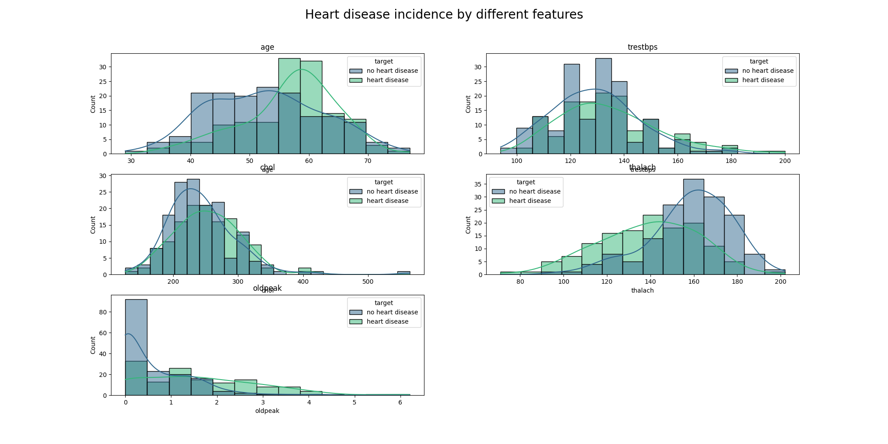

# Heart disease analysis and prediction [XGBoost, SVM, KNN, LR]

## Description

Analysis and prediction of heart disease using various machine learning models.

## Motivation

According to WHO, [cardiovascular diseases are the leading cause of death globally, taking an estimated 17.9 million
lives each year.
Identifying those at highest risk of CVDs and ensuring they receive appropriate treatment can prevent premature
deaths](https://www.who.int/health-topics/cardiovascular-diseases
) [1]

## Data

Dataset contains medical data of patients from Cleveland, US with suspected or diagnosed heart disease.

### Authors

Janosi A., Steinbrunn W., Pfisterer M., & Detrano R. (1988). Heart
Disease. [UCI Machine Learning Repository](https://archive.ics.uci.edu/ml/datasets/Heart+Disease).

### Data description

| Variable Name | Role    | Type        | Description                                           | Units | Missing Values |
|---------------|---------|-------------|-------------------------------------------------------|-------|----------------|
| age           | Feature | Integer     | Age                                                   | years | no             |
| sex           | Feature | Categorical | Sex                                                   |       | no             |
| cp            | Feature | Categorical | Chest pain type                                       |       | no             |
| trestbps      | Feature | Integer     | Resting blood pressure (on admission to the hospital) | mm Hg | no             |
| chol          | Feature | Integer     | Serum cholestoral                                     | mg/dl | no             |
| fbs           | Feature | Categorical | Fasting blood sugar > 120 mg/dl                       |       | no             |
| restecg       | Feature | Categorical | Resting electrocardiographic results                  |       | no             |
| thalach       | Feature | Integer     | Maximum heart rate achieved                           |       | no             |
| exang         | Feature | Categorical | Exercise induced angina                               |       | no             |
| oldpeak       | Feature | Integer     | ST depression induced by exercise relative to rest    |       | no             |
| slope         | Feature | Categorical | The slope of the peak exercise ST segment             |       | no             |
| ca            | Feature | Integer     | Number of major vessels (0-3) colored by flourosopy   |       | yes            |
| thal          | Feature | Categorical | Thalium stress test result                            |       | yes            |
| num           | Target  | Integer     | Diagnosis of heart disease                            |       | no             |

### Notes

- Dataset has missing values
- The num field refers to the presence of heart disease in the patient.
- Experiments with the Cleveland database have concentrated on simply attempting to distinguish presence (values
  1,2,3,4) from absence (value 0).
- Dataset contains 303 instances and 14 attributes

## Code

### Data fetching

Data is fetched from the UCI repository and saved as a .csv file.

### Visualization

- Data exploration was done using pandas library.
- Using seaborn and matplotlib, I created the following visualizations:
    - correlation matrix to see the correlation between the features \
      
    - distribution of the features \
      
      
    - pairplot of the features \
      

### Preprocessing

- Target variable was transformed to binary variable (0 - no heart disease, 1 - heart disease)
- Outliers detection was done using IQR method. Outliers were transformed to the upper and lower bounds.

### Model training and evaluation

#### Models

- The data were split into training and testing sets.
- The following models were used:
    - XGBoost
    - Support Vector Machine
    - K Nearest Neighbors
    - Logistic Regression
- A pipeline was created for each model to scale the data and train the model.
- Cross-validation was employed to evaluate the models.
- Cross-validation was particularly utilized due to the small dataset size to avoid overfitting.
- The following metrics were utilized to evaluate the models:
    - Accuracy
    - Precision
    - Recall

## Results

- Results were dependent on the random state of the train-test split and cross-validation.
- XGBoost, Supported Vector Machine and Logistic Regression models performed equally well.
- Models performed better than their baseline counterparts
  from [UCI](https://archive.ics.uci.edu/dataset/45/heart+disease)

| Model               | Average Performance | Baseline |
|---------------------|---------------------|----------|
| XGBoost             | 0.84                | 0.81     |
| SVM                 | 0.84                | 0.65     |
| Logistic Regression | 0.83                | 0.81     |
| KNNeighbors         | 0.82                | N/A      |

## References

[1] https://www.who.int/health-topics/cardiovascular-diseases
